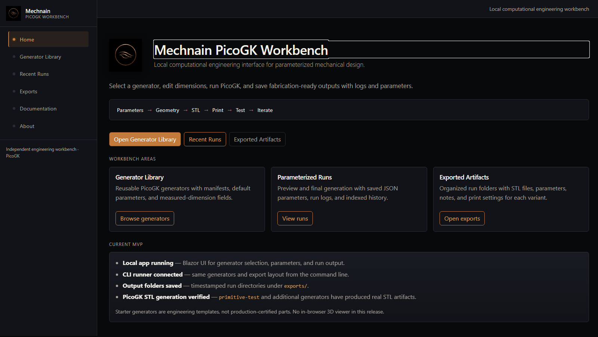
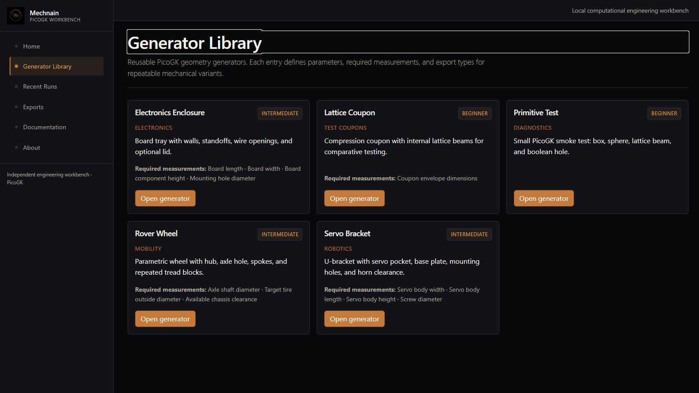
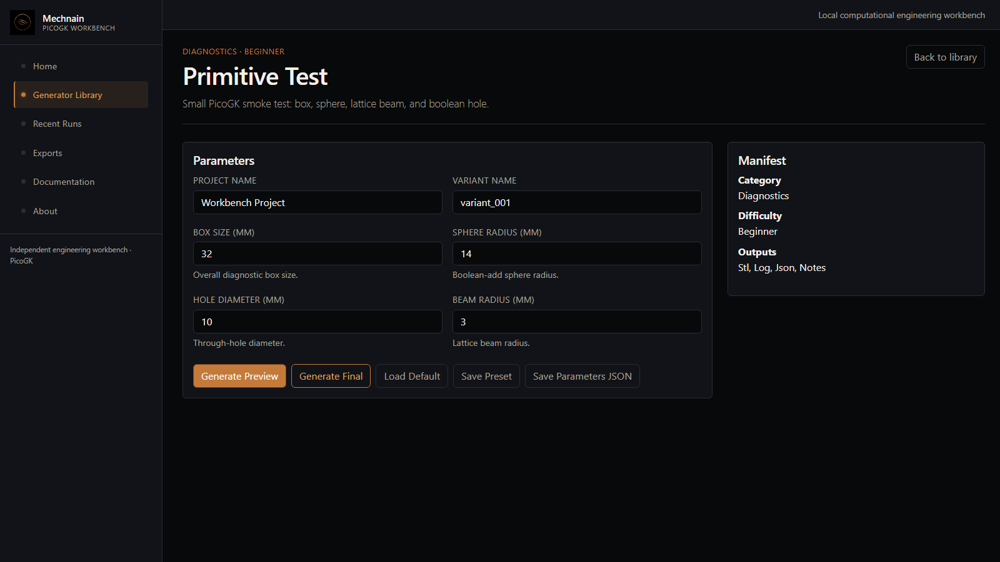
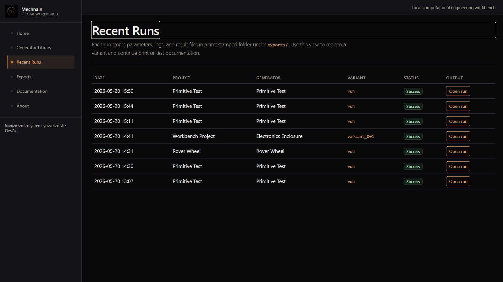
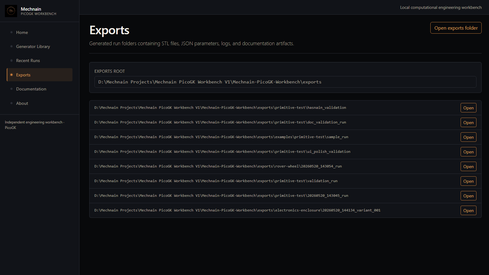

# Mechnain PicoGK Workbench

A local-first computational engineering workbench for running parameterized PicoGK geometry generators, organizing outputs, and documenting design variants for 3D-printable mechanical and robotics components.

**Repository maturity:** This repository is an MVP/prototype for experimenting with local computational geometry workflows. Built-in mechanical generators are starting points and require engineering validation before physical use.

## What this is

Mechnain PicoGK Workbench wraps [LEAP 71 PicoGK](https://github.com/leap71/PicoGK) with a repeatable project structure:

- **Local web UI** (Blazor Server) — generator library, parameter forms, run history, exports browser
- **CLI runner** — same generators and export layout from the terminal
- **Manifest-driven generators** — parameters, units, required measurements, preview/final modes
- **Organized export folders** — each run stores JSON parameters, results, logs, notes, and STL when export succeeds

PicoGK remains the geometry kernel. This repository does not modify PicoGK source code. It is an **independent project** and is not affiliated with or endorsed by LEAP 71.

## Why I built it

PicoGK is effective for computational mechanical geometry, but one-off scripts make it easy to lose parameters, logs, and STL paths across iterations. I built this workbench to explore how those workflows can become **more repeatable**: generator → parameters → geometry → artifacts → documentation → print/test/iterate.

The goal is practical experimentation and learning—not a finished commercial CAD product.

## What it currently does

- Local Blazor app with generator library and parameter editor
- Preview and final generation modes (different voxel resolution)
- CLI runner with `--list` and `--generator`
- Timestamped folders under `exports/{generatorId}/{timestamp}_{variant}/`
- Saved `used_params.json`, `result.json`, `run_log.txt`, `notes.md`, `print_settings.md`
- **Primitive Test** STL generation verified via PicoGK
- Starter mechanical generators (rover wheel, servo bracket, enclosure, lattice coupon)

## Current status

| Area | Status | Notes |
| --- | --- | --- |
| Local app | Working | Runs locally through Blazor Server |
| CLI runner | Working | Supports `--list` and `--generator` |
| Primitive test STL | Verified | Real PicoGK STL in run folder |
| Mechanical generators | Starter | Useful templates; not validated production parts |
| Browser STL viewer | Not implemented | Use external viewer; planned V0.3 |
| AI assistant | Not implemented | Planned future layer (V0.6) |
| Cloud hosting | Not implemented | Local-first by design |

## Screenshots

Store captures under `docs/assets/screenshots/`. See [docs/screenshot_checklist.md](docs/screenshot_checklist.md) for what to capture.

| View | Path | Purpose |
| --- | --- | --- |
| Home | `docs/assets/screenshots/home.png` | Workbench landing / dashboard |
| Generator Library | `docs/assets/screenshots/generator-library.png` | Available generators |
| Generator Detail | `docs/assets/screenshots/generator-detail.png` | Parameter-driven workflow |
| Recent Runs | `docs/assets/screenshots/recent-runs.png` | Saved run history |
| Exports | `docs/assets/screenshots/exports.png` | Generated output folders |



<p align="center">
  
  
</p>

<p align="center">
  
  
</p>

## Architecture

```text
Mechnain-PicoGK-Workbench/
  src/
    Workbench.App/          Blazor Server UI
    Workbench.Runner/       CLI entry
    Workbench.Core/         Manifests, requests, results, paths
    Workbench.Generators/   PicoGK generator implementations
    Workbench.Tests/        Build/registry smoke tests
  generators/               Per-generator manifest + default_params JSON
  exports/                  Run outputs (local); see exports/examples/
  projects/                 Saved parameter variants (local)
  docs/                     Setup, workflow, authoring, assets
```

**Generation flow:**

```text
UI or CLI
  → Generation request
  → GeneratorRegistry
  → IWorkbenchGenerator.Generate
  → PicoGK geometry (voxels / mesh)
  → STL + JSON + logs under exports/
```

Diagram: [docs/assets/diagrams/architecture.md](docs/assets/diagrams/architecture.md)

## Built-in generators

| Generator ID | Purpose | Maturity |
| --- | --- | --- |
| `primitive-test` | PicoGK smoke test (box, sphere, lattice, boolean) | Verified STL |
| `rover-wheel` | Wheel body, hub, spokes, tread | Starter |
| `servo-bracket` | Servo pocket and clearance bracket | Starter |
| `electronics-enclosure` | Tray, walls, standoffs, optional lid | Starter |
| `lattice-coupon` | Lattice comparison coupon | Starter |

These are engineering starting points. They are **not** certified mechanical parts.

## Toolchain

- [.NET 9 SDK](https://dotnet.microsoft.com/download)
- C# / Blazor Server
- [PicoGK](https://github.com/leap71/PicoGK) NuGet package
- External STL viewer/slicer: Bambu Studio, PrusaSlicer, MeshLab, or similar

## Quick start

```bash
git clone https://github.com/mechnain/Mechnain-PicoGK-Workbench.git
cd Mechnain-PicoGK-Workbench
dotnet restore
dotnet build
dotnet run --project src/Workbench.App
```

Open the `http://localhost:...` URL printed in the terminal.

Full setup and troubleshooting: [docs/setup.md](docs/setup.md)

## CLI usage

```bash
dotnet run --project src/Workbench.Runner -- --list
dotnet run --project src/Workbench.Runner -- --generator primitive-test
dotnet run --project src/Workbench.Runner -- --generator rover-wheel --params generators/rover-wheel/default_params.json --quality preview
```

## Example workflow

1. Choose a generator (UI or CLI).
2. Enter measured dimensions.
3. Generate **preview** quality.
4. Inspect STL in an external viewer.
5. Generate **final** quality when the form is right.
6. Slice and print.
7. Test fit, clearance, and function.
8. Update `notes.md` and record results in the run folder.

Details: [docs/workflow.md](docs/workflow.md)

## Output artifacts

Each run writes to:

```text
exports/{generatorId}/{timestamp}_{variant}/
```

Typical contents:

| File | Role |
| --- | --- |
| `used_params.json` | Parameters used for the run |
| `result.json` | Success flag, message, generated file paths |
| `run_log.txt` | PicoGK / runner log lines |
| `notes.md` | Print/test notes (template) |
| `print_settings.md` | Slicer notes (template) |
| `*.stl` | Written when PicoGK export succeeds |

A small **example** run (metadata only) lives under [exports/examples/](exports/examples/). Regenerate STLs locally with the CLI.

`exports/runs_index.json` is created on your machine when you run generators; it is not required for a clean clone.

## Current limitations

- No embedded 3D viewer in the web UI yet
- Local-first only — no cloud generation service
- No authentication or multi-user database
- Not topology optimization, FEA, or AI generative design
- Mechanical generators are starter templates — validate dimensions and manufacturability yourself
- Long **final** runs may block the UI until PicoGK completes
- Manifest JSON on disk mirrors built-in C# manifests; registry discovers built-in classes

## Roadmap

| Phase | Focus |
| --- | --- |
| V0.1 | Working local app, CLI, primitive STL, run folders |
| V0.2 | Polished UI, docs, screenshots |
| V0.3 | Browser STL preview, run detail improvements |
| V0.4 | Better mechanical generators (print-informed) |
| V0.5 | Print/test workflow templates |
| V0.6 | AI-assisted generator selection and parameter drafting (with user approval) |
| V1.0 | Validated local parameter-to-print workflow with tested parts |

Full detail: [ROADMAP.md](ROADMAP.md)

## Attribution

This project uses LEAP 71’s PicoGK as the geometry kernel. PicoGK is an open-source computational geometry kernel. This workbench is an independent project and is not affiliated with or endorsed by LEAP 71.

## License

This repository is [MIT licensed](LICENSE). PicoGK is licensed separately by its authors; this license does not apply to PicoGK itself.

## Repository hygiene

- `bin/`, `obj/`, IDE folders, and most of `exports/` are gitignored
- Intentional sample metadata: `exports/examples/`
- Screenshots: `docs/assets/screenshots/`
- Do not commit large generated run trees or personal machine paths

## Related documentation

| Doc | Description |
| --- | --- |
| [DESIGN_LOG.md](DESIGN_LOG.md) | Decisions, verified vs unverified, limitations |
| [CHANGELOG.md](CHANGELOG.md) | Version history |
| [CONTRIBUTING.md](CONTRIBUTING.md) | How to contribute |
| [docs/setup.md](docs/setup.md) | Install and run |
| [docs/workflow.md](docs/workflow.md) | Engineering loop |
| [docs/generator_authoring.md](docs/generator_authoring.md) | Add a generator |
| [docs/portfolio_export.md](docs/portfolio_export.md) | Portfolio / resume notes |
