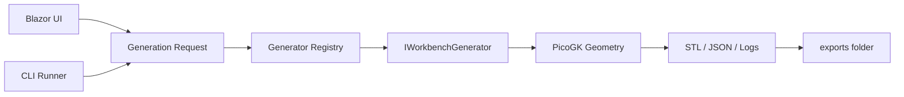

# Architecture

## Component diagram

## Request flow

1. User submits parameters from **Workbench.App** or **Workbench.Runner**.
2. `WorkbenchAppService` / CLI builds a `GenerationRequest` (generator id, variant, quality, values).
3. `GeneratorRegistry` resolves `IWorkbenchGenerator`.
4. Generator uses `PicoGeneration` to build voxels/mesh and call `SaveStl`.
5. Artifacts written under `exports/{generatorId}/{timestamp}_{variant}/`.
6. UI may append to local `exports/runs_index.json` for Recent Runs.

## Projects layout

| Project | Role |
| --- | --- |
| `Workbench.App` | Blazor Server UI |
| `Workbench.Runner` | CLI entry (`--list`, `--generator`) |
| `Workbench.Core` | Models, paths, JSON helpers |
| `Workbench.Generators` | PicoGK implementations + registry |
| `Workbench.Tests` | Contract tests (no PicoGK in CI) |

## Local vs repository

| Path | In git | Notes |
| --- | --- | --- |
| `generators/` | Yes | Manifests and defaults |
| `exports/examples/` | Yes | Sample metadata only |
| `exports/{id}/{run}/` | No (gitignored) | Regenerate locally |
| `projects/` | No (presets gitignored) | Local saved params |
